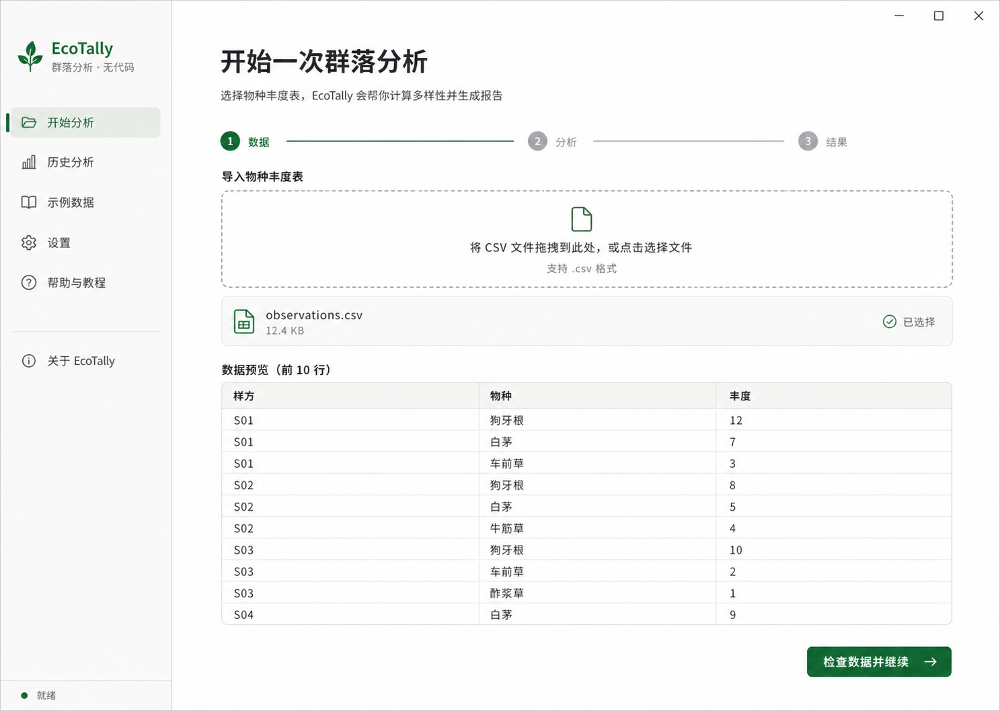

# EcoTally

[English](README.md) · [方法与公式](METHODOLOGY.md) ·
[参与贡献](CONTRIBUTING.md) · [发行说明](RELEASE_NOTES.md) ·
[路线图](ROADMAP.md)

## 给生物学学生的简单说明

如果你手里有一张记录了“样方、物种、数量”的表格，EcoTally 可以把它变成
容易阅读的生物多样性报告。它能帮你看出：每个样方有多少种生物、群落是否
被少数优势种控制、不同样方差别有多大，以及本次采样是否可能漏掉了一些物种。

**Windows 用户直接下载 `EcoTally.exe` 就能使用，不需要安装 Python，也不用
写代码。** 选择 CSV/TSV 表格、勾选想回答的问题，然后查看或导出结果。软件会
用简单语言说明主要发现，同时保留课程作业和可复现研究需要的完整计算结果。



EcoTally 是一个轻量、透明、可复现的开源群落生态学工具。它读取物种丰度
数据，生成 α、β、γ 多样性、采样完整度、稀释曲线、功能多样性和数据质量
报告。核心功能只依赖 Python 标准库，便于审计计算过程和长期保存工作流。

## Windows 桌面版

请从 [GitHub Releases](https://github.com/B2N06/ecotally-tool--/releases/latest)
下载最新版 `EcoTally.exe`。桌面版按“导入数据 → 选择分析 → 查看与导出结果”
三步操作；需要批量处理或编程调用时，仍可使用命令行和 Python 接口。

EcoTally 完全离线运行，不联网、不监听端口，也不需要 Windows 防火墙例外。
下载时请同时取得 `EcoTally.exe.sha256` 并核对文件哈希。Windows 的“未知
发布者”提示属于 SmartScreen 应用信誉检查，不是软件请求联网；详情见
[Windows 安全与可信发布说明](WINDOWS_SECURITY.md)。

## 快速开始

长表数据包含 `site,species,abundance` 三列：

```csv
site,species,abundance
forest,oak,12
forest,fern,7
marsh,reed,20
```

运行分析：

```shell
python -m pip install -e .
python -m ecotally examples/observations.csv
python -m ecotally examples/observations.csv --format markdown -o report.md
```

EcoTally 会自动识别长表和“每行一个样方、每列一个物种”的宽表。
群落、性状和样方元数据均会自动识别逗号、制表符或分号分隔格式。

## 常用分析

```shell
# Bootstrap 置信区间
python -m ecotally examples/observations.csv --bootstrap 999 --format json

# 稀释曲线
python -m ecotally examples/observations.csv --rarefaction 20 --format json

# Hill 多样性谱
python -m ecotally examples/observations.csv --hill-orders 0,0.5,1,2,3 \
  --format markdown

# 功能性状分析；不同单位的性状先标准化
python -m ecotally examples/observations.csv --traits examples/traits.csv \
  --standardize-traits --format markdown

# 输出可用于 R、GIS 或聚类的距离矩阵
python -m ecotally examples/observations.csv --format matrix \
  --metric bray_curtis

# 生成无额外绘图库依赖的矢量图
python -m ecotally examples/observations.csv --format svg -o diversity.svg

# 导出完整 JSON、清单和各报告分区 CSV
python -m ecotally examples/observations.csv --format bundle -o analysis

# 联接处理组、年份、栖息地、坐标等样方元数据
python -m ecotally examples/observations.csv \
  --site-metadata examples/site-metadata.csv --format json

# 按栖息地汇总各组 α、β、γ 多样性
python -m ecotally examples/observations.csv \
  --site-metadata examples/site-metadata.csv --group-by habitat \
  --format markdown

# 对两个组的平均 Shannon 差进行标签置换检验
python -m ecotally examples/observations.csv \
  --site-metadata examples/site-metadata.csv --group-by habitat \
  --group-metric shannon --group-permutations 999 --format markdown
```

## 结果解释

- 丰富度只计算丰度大于零的物种。
- Shannon 指数使用自然对数。
- Simpson 多样性为 `1 - Σp²`，逆 Simpson 为 `1 / Σp²`。
- Jaccard 和 Sørensen 使用出现/未出现数据；Bray–Curtis 使用丰度。
- Chao1、稀释和 Bootstrap 要求非负整数个体数。
- 功能距离使用欧氏距离；性状单位不同时建议启用标准化。
- 报告会标注空样方、全零物种和严重采样不平衡。
- 报告包含 Berger–Parker 优势度以及可直接绘图的等级–丰度数据。
- LCBD 与 SCBD 分解会指出组成最独特的样方和推动整体差异的物种。
- Sørensen 差异会分解为物种替代与丰富度嵌套两部分。

使用 `--lcbd-permutations 999` 可对 LCBD 运行可复现的物种列置换检验。

完整定义、公式和边界条件见 [METHODOLOGY.md](METHODOLOGY.md)。

## 可复现性

JSON 和 Markdown 报告包含 EcoTally 版本、运行参数、输入文件名和 SHA-256
哈希。相同数据与参数会产生相同的 Bootstrap 结果。

## 开源与引用

项目采用 MIT 许可证。研究中使用时请引用仓库中的 `CITATION.cff`。
贡献流程见 [CONTRIBUTING.md](CONTRIBUTING.md)。
